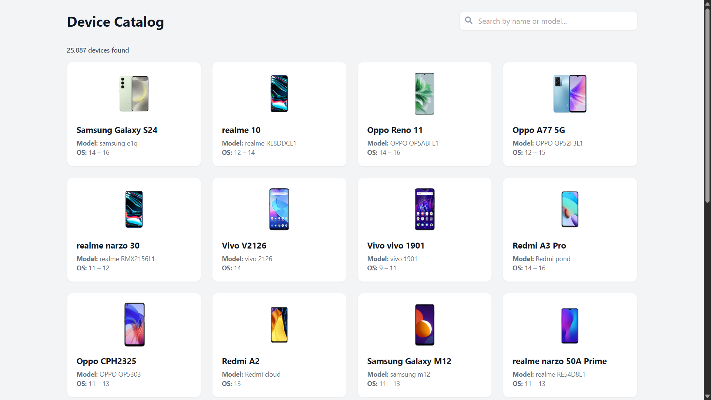
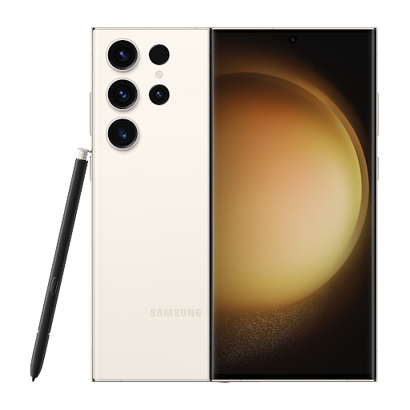
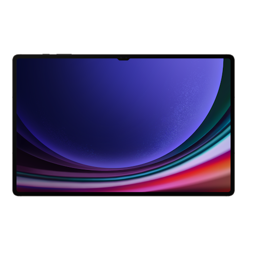
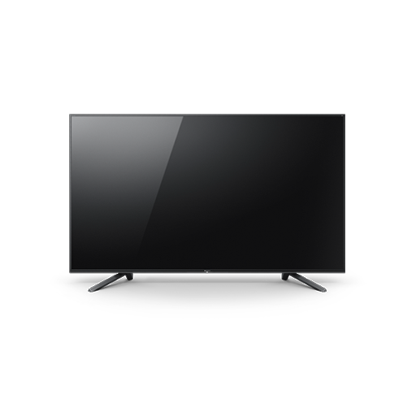
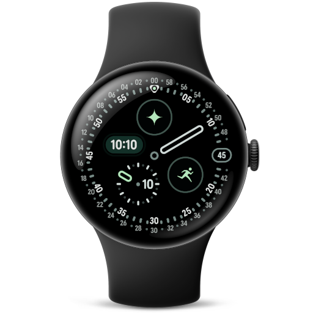
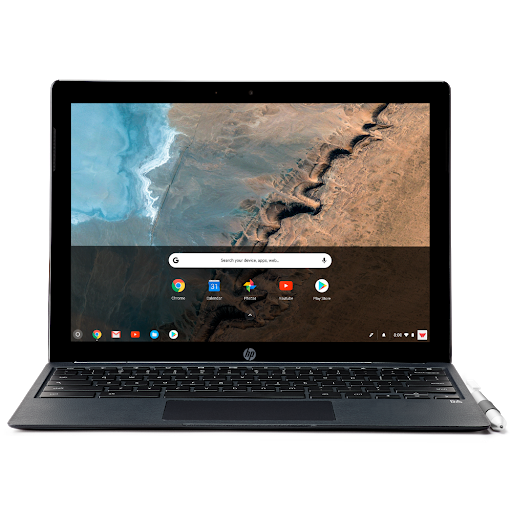

# Android Device Catalog 📱

A comprehensive, lightning-fast web explorer and dataset containing information on over **25,000+ officially certified Android devices** (including Smartphones, Tablets, Android TVs, Wearables, and Chrome OS devices).

✨ **[Click Here for Live Demo](https://anujsehrawat1.github.io/Android-Device-Catalog/web/)** ✨



## 📊 Sample Data

Here is a glimpse of the kind of data available in this catalog:

| Image | Marketing Name | Model Code | OS / Platform | Form Factor |
| :---: | :--- | :--- | :--- | :--- |
|  | **Samsung Galaxy S23 Ultra** | `samsung SC-52D` | Android | Smartphone |
|  | **Samsung Galaxy Tab S9 Ultra** | `samsung gts9uwifi` | Android | Tablet |
|  | **Sony BRAVIA CT1** | `Sony BRAVIA_CT1` | Android TV | Smart TV |
|  | **Google Pixel Watch 4** | `google meridian_lte` | Wear OS | Smartwatch |
|  | **HP Chromebook x2** | `google soraka_cheets` | Chrome OS | Chromebook |

## Features
- **Massive Dataset**: Contains detailed information (Model, Marketing Name, Android OS Versions) for 25,000+ devices.
- **Offline & Static**: The entire database and search functionality runs purely on the client-side (Browser). No backend required!
- **Lightning Fast Search**: Instantly filter devices by Name, Model, or Android version.
- **High-Quality Renders**: Includes SVG and WebP dummy renders for the devices.
- **Responsive UI**: Built with Tailwind CSS. Beautiful Grid view for desktop and optimized layouts for mobile.

## Repository Structure
- `/web` - The core frontend web application (HTML, JS, Tailwind).
- `/data` - The structured device dataset (`devices_data.js` and JSON versions) ready to be consumed by any app.
- `/images` - The localized directory containing device images and icons.

## How to use locally
Since the architecture is 100% static and client-side, you do not need to install any Node.js server or Python backend. 
Simply clone the repository and open the HTML file in any modern web browser:

```bash
git clone https://github.com/anujsehrawat1/Android-Device-Catalog.git
```
Then, double-click on `web/index.html` to start exploring the catalog!

## Integrating the Data
If you want to use this massive database in your own project, simply grab the `data/devices.json` file. The schema is extremely straightforward:
```json
{
    "Name": "Galaxy S23 Ultra",
    "Model": "SM-S918B",
    "Version": "13",
    "Image_URL": "/images/sm_s918b.png"
}
```

## 🤖 Automated Updates

To keep the catalog up-to-date without manually scraping the entire Play Console again, this project includes a smart automation script. It filters the Play Console for recently added devices, downloads their images, updates the database, and pushes to GitHub automatically. 
Check out the [Automated Updater](updater/README.md) for details on how to use it!

## Contributing
Pull requests are welcome! If you notice any missing devices or have updated device images, feel free to contribute to the dataset.
